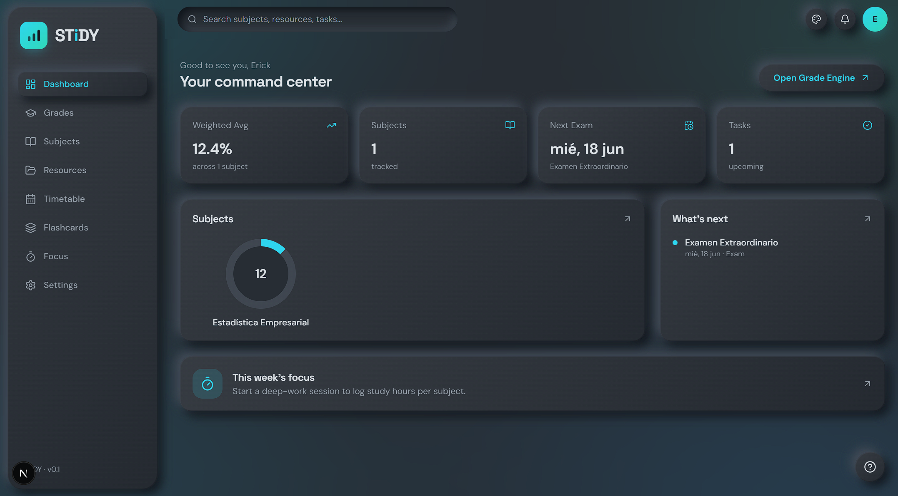
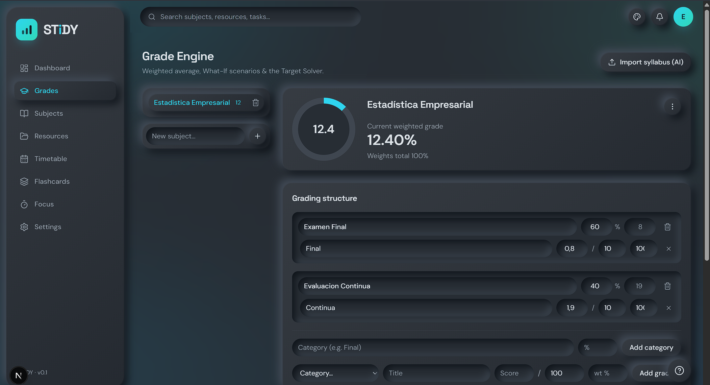
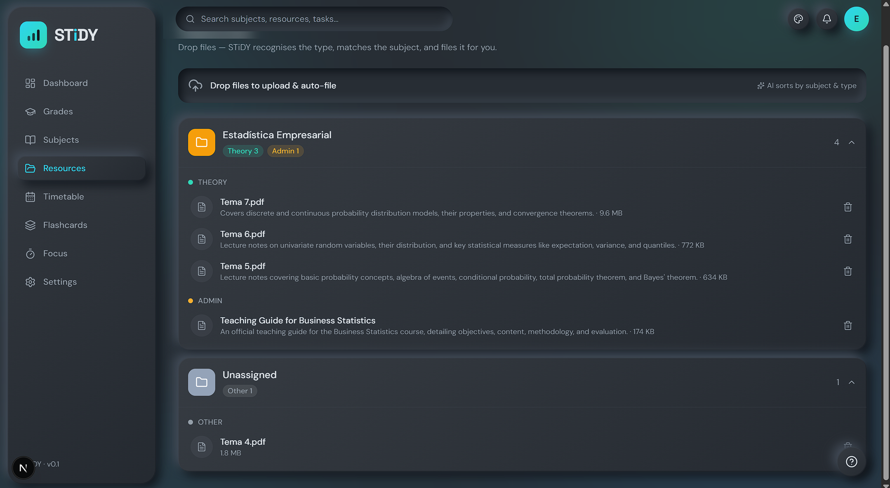
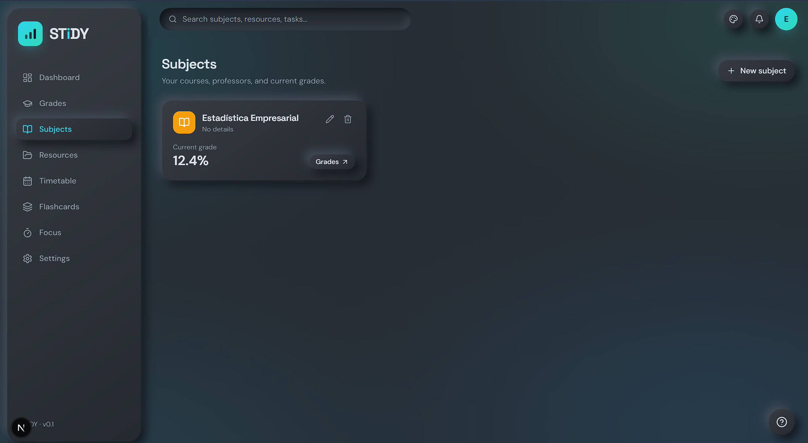
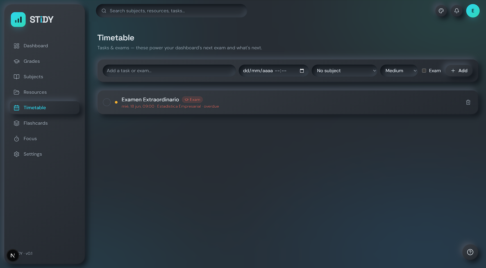
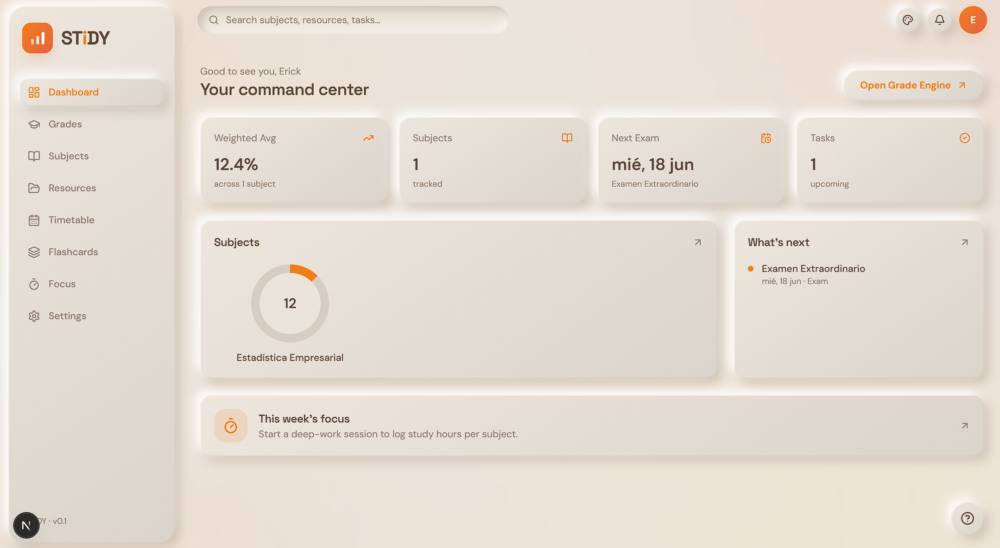
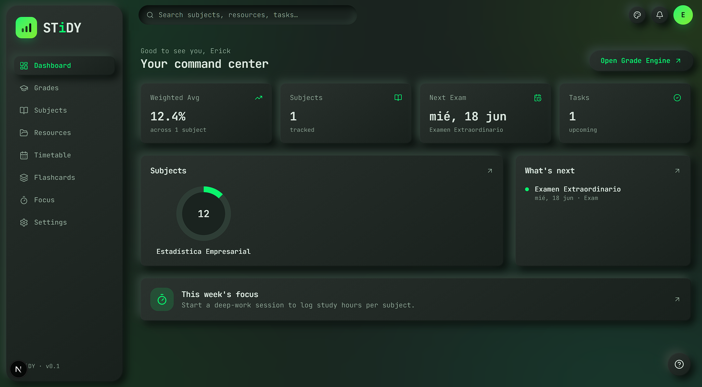

<div align="center">


### Your academic operating system.

**STiDY** unifies grades, syllabi, resources, flashcards, focus, and timetable into one
intelligent, beautifully tactile command center — wrapped in a neumorphic design system,
nine hand-sculpted themes, and an AI study assistant that actually knows your semester.

[](https://stidy-silk.vercel.app)
[](https://nextjs.org)
[](https://react.dev)
[](https://www.typescriptlang.org)
[](https://tailwindcss.com)
[](https://supabase.com)
[](https://vercel.com)

</div>

---

## ✨ What is STiDY?

STiDY is a single-student academic OS. Instead of juggling a grade spreadsheet, a notes
folder, a calendar, a flashcard app and a Pomodoro timer, everything lives in one place —
and an AI assistant grounded in *your* data answers questions like *"what do I need on the
final to pass?"* or *"what's due this week?"*.

It ships **bilingual (EN + ES)** and is built for students in the Spanish academic system
(EVAU, cuatrimestres, oposiciones) as much as anywhere else.

<div align="center">
  
  <br/><sub><em>The dashboard — a drag-and-drop command center: grade dials, next-exam countdown, weekly focus.</em></sub>
</div>

## 🧩 Features

| Surface | What it does |
|---|---|
| **Dashboard** | A customizable, drag-and-drop widget grid (`@dnd-kit`) — grade dials, weekly-focus ring, next-exam countdown, live clock, scratchpad, a study-buddy duck, and rotating study quotes. |
| **Grade Engine** | Weighted-average computation, **What-If** scenario sliders, and a **Target Solver** ("what do I need on what's left to hit my goal?"). Multiple grade scales (percent / out-of-10 / letter / GPA). |
| **Study Lab** | AI-generated **flashcards** and **practical/written exams** from a subject, tuned to difficulty — with a spaced-repetition review flow and a worked-solution exam viewer. |
| **Focus** | A deep-work timer + stopwatch with study-session logging, ambience, and a weekly focus goal. |
| **Resources** | A drag-and-drop resource vault — drop files to auto-file them by subject, with an in-app viewer. |
| **Subjects & Careers** | Group courses by degree, school year, or *oposición*; track professors and current grades. |
| **Timetable** | Tasks & exams that power the dashboard's next-exam and "what's next" widgets. |
| **Ask STiDY** | A floating AI assistant that knows your subjects, grades, deadlines and materials — with a switchable model picker and an honest fallback indicator. |
| **Settings** | Theme engine, grade-scale preference, and per-tool manuals. |

<table>
  <tr>
    <td width="50%"></td>
    <td width="50%"></td>
  </tr>
  <tr>
    <td align="center"><sub><em>Grade Engine — weighted average, What-If &amp; Target Solver.</em></sub></td>
    <td align="center"><sub><em>Resource Vault — AI sorts uploads by subject &amp; type.</em></sub></td>
  </tr>
  <tr>
    <td width="50%"></td>
    <td width="50%"></td>
  </tr>
  <tr>
    <td align="center"><sub><em>Subjects &amp; Careers — grouped by degree or oposición.</em></sub></td>
    <td align="center"><sub><em>Timetable — tasks &amp; exams powering the dashboard.</em></sub></td>
  </tr>
</table>

## 🎨 Design system — "Soft UI", dialed to 11

Every surface is **neumorphic** (Soft UI): one surface color sculpted with a dual
light/dark shadow, a convex sheen, and an inner bevel. It's defined CSS-first in
[`src/app/globals.css`](src/app/globals.css).

<table>
  <tr>
    <td width="33%"></td>
    <td width="33%"></td>
    <td width="33%"></td>
  </tr>
  <tr>
    <td align="center"><sub><em>Midnight</em></sub></td>
    <td align="center"><sub><em>Warm Paper</em></sub></td>
    <td align="center"><sub><em>Chalkboard / Terminal</em></sub></td>
  </tr>
</table>

<div align="center"><sub>Three of the nine — the entire surface re-skins live from the theme picker.</sub></div>

- **9 hand-sculpted themes** — Nexus, Soft, Soft Dark, Cyber, Metal (brushed aluminium),
  Aurora, Sunset, Graphite, and **Chalkboard** (a matte classroom board). Each is a full
  token set; switch instantly via the theme picker.
- **Skeuomorphic `.dial`** — a carved-channel radial gauge with a glowing accent fill and a
  raised cap, used for grade dials, the focus ring, and subject mastery.
- **Tactile primitives** — physical buttons (`.neu-btn`), carved inputs (`.field`),
  edge-lit cards (`.hairline`), deeper hero elevation (`.neu-lg`), engraved display type,
  a film-grain overlay, and **theme-aware scrollbars**.
- **Motion vocabulary** — a single source of truth (`src/lib/motion.ts`): shared easings,
  springs, and entrance variants (`reveal`, `scaleIn`, stagger), all honouring
  `prefers-reduced-motion`.

## 🤖 AI architecture

STiDY routes AI through a **resilient provider chain** ([`src/lib/ai/models.ts`](src/lib/ai/models.ts)):

```
your picked NVIDIA model  →  Gemini  →  Groq
        (primary)            (fallback)  (fallback)
```

- **NVIDIA NIM** is primary for chat/text; the in-app picker exposes a set of
  **completion-verified** models ([`src/lib/ai/catalog.ts`](src/lib/ai/catalog.ts)).
- **Gemini** stays primary for structured + vision tasks (syllabus parsing, etc.).
- On rate-limit, the chain waits the suggested delay, retries, then falls through — so a
  busy free tier never hard-fails. Every answer is **labelled with the model that actually
  replied**, and the assistant shows a warning when a less-capable fallback answered.

## 🛠️ Tech stack

- **Framework** — Next.js 16 (App Router, Turbopack), React 19, TypeScript 5
- **Styling** — Tailwind CSS v4 (CSS-first `@theme`, no `tailwind.config.ts`)
- **Backend** — Supabase (Postgres + Auth, `@supabase/ssr`)
- **State/Data** — Zustand, TanStack Query
- **AI** — Vercel AI SDK (`ai`) with `@ai-sdk/anthropic` · `@ai-sdk/google` · `@ai-sdk/groq` · `@ai-sdk/openai-compatible` (NVIDIA NIM)
- **UI/UX** — Framer Motion, `@dnd-kit`, Recharts, KaTeX (math), `lucide-react`, `date-fns`
- **Deploy** — Vercel (auto-deploy from `main`)

## 🚀 Getting started

### Prerequisites
- **Node.js 20+** and npm
- A **Supabase** project (free tier is fine)
- API keys for the AI providers you want (NVIDIA NIM, Google Gemini, Groq)

### 1. Install
```bash
npm install
```

### 2. Configure environment
Copy the template and fill in your values:
```bash
cp .env.example .env.local
```

| Variable | Required | Where to get it |
|---|:---:|---|
| `NEXT_PUBLIC_SUPABASE_URL` | ✅ | Supabase → Settings → API → Project URL |
| `NEXT_PUBLIC_SUPABASE_ANON_KEY` | ✅ | Supabase → Settings → API → anon/public |
| `SUPABASE_SERVICE_ROLE_KEY` | ○ | Supabase → Settings → API → service_role |
| `NVIDIA_API_KEY` | ○ | [build.nvidia.com](https://build.nvidia.com) |
| `GOOGLE_GENERATIVE_AI_API_KEY` | ○ | [aistudio.google.com](https://aistudio.google.com) |
| `GROQ_API_KEY` | ○ | [console.groq.com](https://console.groq.com) |

> Without the two Supabase keys, auth/data fail and every route 500s. The AI keys are
> optional but light up Ask STiDY and Study Lab generation.

### 3. Run
```bash
npm run dev      # http://localhost:3000
```

## 📜 Scripts
| Script | Description |
|---|---|
| `npm run dev` | Start the dev server (Turbopack) |
| `npm run build` | Production build (runs full type-check) |
| `npm run start` | Serve the production build |
| `npm run lint` | ESLint |

## 🗂️ Project structure

A **feature-sliced** App Router layout — routes stay thin; domain logic lives in
`src/features/*`.

```text
src/
├─ app/
│  ├─ (auth)/            # public: login, signup
│  ├─ (app)/             # protected shell (sidebar + topbar + ambient mesh)
│  │  ├─ dashboard/  grades/  flashcards/  focus/
│  │  ├─ resources/  subjects/  timetable/  settings/
│  ├─ api/               # route handlers (AI streaming, syllabus, grades…)
│  ├─ showcase/          # public design-system showcase
│  ├─ globals.css        # ← the neumorphic theme engine (9 themes)
│  └─ layout.tsx         # root providers (theme, query)
├─ components/
│  ├─ ui/                # primitives (Dial, Modal, Dropdown, NeuSlider…)
│  ├─ motion/            # Framer Motion wrappers (FadeIn, Stagger, Reveal…)
│  ├─ layout/            # Sidebar, Topbar, MeshBackground, PageTransition
│  └─ brand/             # Logo
├─ features/             # the real app — grades, studylab, focus, resources, …
├─ lib/
│  ├─ supabase/          # client / server / proxy
│  ├─ ai/                # provider chain + model catalog
│  └─ motion.ts          # shared motion vocabulary
├─ config/themes.ts      # theme registry
└─ stores/  types/
```

## ☁️ Deployment

Deployed on **Vercel**, auto-deploying from `main`. Set the same environment variables in
**Project → Settings → Environment Variables** (Production / Preview / Development), then
every push to `main` builds and ships. Standard workflow:

```bash
npm run build && git add -A && git commit -m "…" && git push origin main
```

## 🧭 Conventions

- **Tailwind v4 is CSS-first** — tokens live in `@theme inline`; no config file.
- **Server-authoritative data** — currency/grades/stats validated server-side; client only
  predicts visuals.
- **Reveal-when-ready loading** — managers return `null` while loading, then reveal the
  whole view with a quick fade (no skeleton flashes).
- **Reduced-motion respected** everywhere via a global CSS killswitch.

## 📄 License

Private project. All rights reserved © STiDY.

<div align="center">
<sub>Built with care, real visual taste, and a study-buddy duck. 🦆</sub>
</div>
