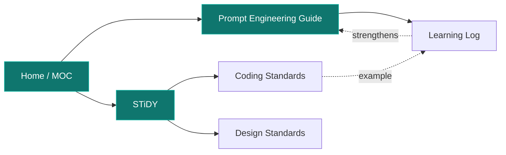
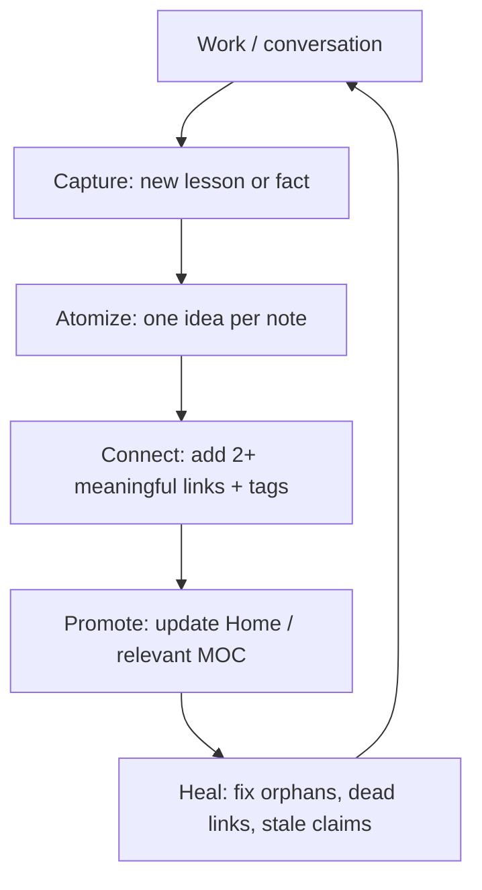

# Improving the Knowledge Graph

The "neural network / vision board" Erick means is **Obsidian's graph view** — the living web of
notes connected by `[[wikilinks]]`. A good graph isn't decoration; it's *retrieval*. Dense, well-shaped
links mean I (and Erick) can find and combine ideas the way a brain associates. This note is how that
web gets denser and smarter, plus the protocol for me to **actively learn into it**.

> [!abstract] One-line goal
> Turn a tree of static notes into a **self-strengthening associative memory**: more good links, fewer
> orphans, clear hubs, and a loop that adds + connects knowledge every session.

## What makes a graph "intelligent"

A graph behaves like a neural network when:

- **Edges are meaningful, not decorative.** Every `[[link]]` is a real relationship (depends-on,
  contradicts, example-of, part-of), not a name-drop.
- **There are hubs (high-degree nodes).** [[Home]], [[STiDY]], and [[Prompt Engineering Guide]] should
  be densely connected — they're the "association centers."
- **Few orphans.** A note with no inbound links is invisible to the network. Every note earns ≥1
  inbound and ≥1 outbound link.
- **Two axes of structure.** `[[links]]` = associative (graph); `#tags` = categorical (faceted search).
  Use both — they catch different recall paths.
- **Atomic where it matters.** One idea per note links more flexibly than a giant page. Split when a
  note starts doing two jobs.

## Concrete ways to improve it

1. **Link liberally, link precisely.** When writing any note, drop `[[links]]` to every concept it
   touches — even to notes that don't exist yet (a "ghost" link is a TODO for a future note, and shows
   as a faded node).
2. **Grow Maps of Content (MOCs).** [[Home]] is the master MOC. Add topic MOCs as clusters mature
   (e.g. an "AI in STiDY" MOC linking Tech Stack, Claude's API Reference, the AI features).
3. **Add a reverse link when you cite.** If note A references B, make sure B (or its context) can get
   back to A. Backlinks are free in Obsidian — but only if the forward link exists.
4. **Use `aliases`** so links resolve naturally (`[[Vision Board]]` → this note).
5. **Tag a second axis.** Keep a small, disciplined tag set (`#meta`, `#standards`, `#backlog`,
   `#learning`, `#stidy`) rather than a sprawl. Faceted, not chaotic.
6. **Visual layers.** Use **Canvas** (`.canvas`) for spatial maps and **Bases** (`.base`) for dynamic
   tables/queries over notes (e.g. "all open backlog items"). These are the literal "vision board."
7. **Prune + heal.** Periodically lint for orphans, dead links, and stale claims; merge duplicates;
   split overgrown notes.

> [!tip] Health metrics to watch
> - **Orphan count → 0.** No isolated nodes.
> - **Avg links per note ≥ 3.** Below that, the graph is too sparse to associate.
> - **Hub coverage.** Can I reach any note from [[Home]] in ≤2 hops?
> - **Link rot = 0.** No dead `[[wikilinks]]` after renames.

## The learning protocol (how I keep learning)

This is the loop I run so the second brain compounds instead of going stale:

- **After every session:** add to [[Learning Log]] (newest-first, dated, concrete), and link the lesson
  into the standards it affects ([[Coding Standards]], [[Design Standards]], [[Prompt Engineering Guide]]).
- **When a cluster matures:** create or update a MOC and link it from [[Home]].
- **When something changes (a file moves, a flag changes):** verify, then update or delete the stale
  note — don't let the graph lie.
- **Periodic maintenance:** run a health pass (orphans, dead links, duplicates) — the
  `claude-obsidian:wiki-lint` skill automates this; `wiki-fold` rolls up long logs; `autoresearch`
  pulls in outside knowledge on a topic and files it linked.
- **Spaced revisiting:** resurface old notes when related work appears, and enrich them — the way
  recall strengthens a synapse.

## Tooling (now that kepano's substrate is installed)
- `obsidian:obsidian-markdown` — authoritative syntax (used to write this).
- `obsidian:obsidian-cli` — read/search/create/modify vault notes from the command line; point it at
  this vault to query and grow it programmatically.
- `obsidian:json-canvas` — build visual maps (the literal vision board).
- `obsidian:obsidian-bases` — dynamic database views over notes.

> [!success] Status
> Active learning protocol **started 2026-06-14** — see the kickoff entry in [[Learning Log]].

Related: [[Home]] · [[Welcome]] · [[Learning Log]] · [[General Remarks and Future Plans]] ·
[[Plugins and Skills Status]]
